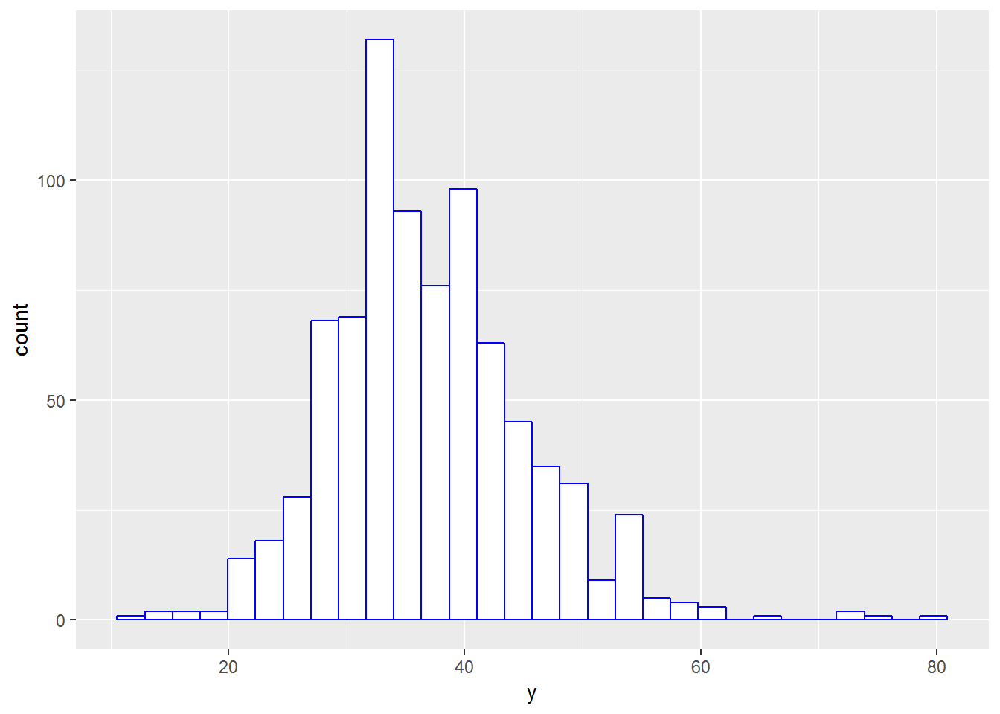

有网友问我，能否批量进行方差分析与多重比较及其结果的提取。答案是肯定的。在之前的博文《巧用plyr包进行线性模型的批量分析》[1]，演示了借助plyr包进行线性模型的批量分析。本文除了plyr包外，先演示for循环来实现方差分析的批量分析。不过R用户一般不建议使用for循环，数据量一般庞大后，for循环运行会比较慢。

<!--more-->

00 示例数据集
-------------

示例采用breedRPlus包的数据集dfm2。
```r
    ## data sets
    data(dfm2,package='breedRPlus')

    # Only keep aim factors and traits for analysis
    dat<-dfm2[,c(4:5,10:14)] 

    # 将需要的分析性状(h1,h2,...)整合到变量Trait下，
    # 将性状(h1,h2,...)对应的数值整合到变量y下，
    # 以便使用plyr的dlply()通过Trait进行批量分析
    dat1 <- tidyr::gather(dat,key=Trait,y,-c(1:2))
```
01 使用for循环
--------------

首先，编写for循环进行方差分析和多重比较的函数，具体代码如下：
```r
    # method 1: for() control
    aov.batch1 <- function(df) {
      nn<-ncol(df)-2
      res<-list()

      for(i in 1:nn){
        df2<-df[,c(1:2,2+i)]
        names(df2)[3]<-'y'
        
        # user should adjust here
        fit<-aov(y~Spacing*Rep,data=df2)
        aov.res<-summary(fit) # list
        
        res1<-list()
        fn<-names(df2)[1:2]
        for(j in 1:2){
          res1[[j]]<-duncan.test(fit,fn[j],alpha=.05)$groups
        }
        names(res1)<-fn
        
        res2<-list()
        dfE<-aov.res[[1]]['Residuals','Df']
        MsE<-aov.res[[1]]['Residuals','Mean Sq']
        
        # user should adjust here
        res2[['Spacing:Rep']]<-with(df2, 
                                    duncan.test(y,Spacing:Rep,
                                                DFerror=dfE,MSerror=MsE))$groups
        
        res[[i]]<-list(aov.res,res1,res2)
        names(res[[i]])<-c('aov','comp1','comp2')
      }
      names(res)<-names(df)[-1:-2]
      return(res)
    } 
```
现在使用for循环的函数aov.batch1()来试试批量分析，用法简单，代码如下：
```r
res1<-aov.batch1(dat)

res1$h1$aov
##              Df Sum Sq Mean Sq F value   Pr(>F)    
## Spacing       1   1682  1682.1  27.279 2.24e-07 ***
## Rep           4   5847  1461.8  23.707  < 2e-16 ***
## Spacing:Rep   4    731   182.7   2.963   0.0191 *  
## Residuals   817  50379    61.7                     
## ---
## Signif. codes:  0 '***' 0.001 '**' 0.01 '*' 0.05 '.' 0.1 ' ' 1

res1$h1$comp1
## $Spacing
##          y groups
## 2 39.10448      a
## 3 36.05725      b
## 
## $Rep
##          y groups
## 4 40.61212      a
## 3 39.60667      a
## 1 36.03593      b
## 5 34.86911      b
## 2 34.51948      b

res1$h1$comp2
## $`Spacing:Rep`
##            y groups
## 2:4 44.52174      a
## 2:3 40.30303      b
## 3:3 39.41026      b
## 2:2 39.20833      b
## 3:4 39.10084     bc
## 2:1 37.76812    bcd
## 2:5 36.30556    cde
## 3:1 34.81633    def
## 3:5 34.00000     ef
## 3:2 32.39623      f
```
输出结果，演示了第一个性状h1的分析结果，包括方差分析表、主效应及其互作的多重比较。读者应当明白，当互作效应显著时，是没必要进行单因子的多重比较！这里只是演示目的，不做过多的结果解读！

02 使用plyr包
-------------

首先，编写方差分析和多重比较的通用函数，与for循环的代码非常相似，只是去掉了主体的for循环，具体代码如下：
```r
    aov.batch2 <- function(df) {
      res<-list()
      
      # user should adjust here
      fit<-aov(y~Spacing*Rep,data=df) 
      aov.res<-summary(fit) # list
      
      res1<-list()
      fn<-names(df)[1:2]
      for(j in 1:2){
        res1[[j]]<-duncan.test(fit,fn[j],alpha=.05)$groups
      }
      names(res1)<-fn
      
      res2<-list()
      dfE<-aov.res[[1]]['Residuals','Df']
      MsE<-aov.res[[1]]['Residuals','Mean Sq']
      
      # user should adjust here
      res2[['Spacing:Rep']]<-with(df, 
                                  duncan.test(y,Spacing:Rep,
                                              DFerror=dfE,MSerror=MsE))$groups
      
      res<-list(aov.res,res1,res2)
      names(res)<-c('aov','comp1','comp2')
      res
    }
```
现在使用函数aov.batch2()来试试批量分析，但需要注意与之前的plyr包用法不同，这里需要使用**<span
style="color:red">dlpy()</span>**来返回列表，而不是之前的ddpy()，后者只能返回数据框。
```r
res2 <- plyr::dlply(dat1,"Trait",aov.batch2) 

res2$h1$aov
##              Df Sum Sq Mean Sq F value   Pr(>F)    
## Spacing       1   1682  1682.1  27.279 2.24e-07 ***
## Rep           4   5847  1461.8  23.707  < 2e-16 ***
## Spacing:Rep   4    731   182.7   2.963   0.0191 *  
## Residuals   817  50379    61.7                     
## ---
## Signif. codes:  0 '***' 0.001 '**' 0.01 '*' 0.05 '.' 0.1 ' ' 1

res2$h1$comp1
## $Spacing
##          y groups
## 2 39.10448      a
## 3 36.05725      b
## 
## $Rep
##          y groups
## 4 40.61212      a
## 3 39.60667      a
## 1 36.03593      b
## 5 34.86911      b
## 2 34.51948      b

res2$h1$comp2
## $`Spacing:Rep`
##            y groups
## 2:4 44.52174      a
## 2:3 40.30303      b
## 3:3 39.41026      b
## 2:2 39.20833      b
## 3:4 39.10084     bc
## 2:1 37.76812    bcd
## 2:5 36.30556    cde
## 3:1 34.81633    def
## 3:5 34.00000     ef
## 3:2 32.39623      f
```
如果函数aov.batch2()里含有ggplot2绘制图的对象，可以通过print()来查看图形：
```r
    print(res2$h1$y.hist)
```


<p class="caption">
性状h1的直方图
</p>

上述结果隐藏了很多结果，事实上res1和res2结果是一样的，它们都是列表，但含有比较多的组分，有点复杂，可以通过str()来查看。
```r
class(res1)
## [1] "list"
names(res1)
## [1] "h1" "h2" "h3" "h4" "h5"

str(res1[1:2]) #展示列表的前2个组分的结构
## List of 2
##  $ h1:List of 3
##   ..$ aov  :List of 1
##   .. ..$ :Classes 'anova' and 'data.frame':  4 obs. of  5 variables:
##   .. .. ..$ Df     : num [1:4] 1 4 4 817
##   .. .. ..$ Sum Sq : num [1:4] 1682 5847 731 50379
##   .. .. ..$ Mean Sq: num [1:4] 1682.1 1461.8 182.7 61.7
##   .. .. ..$ F value: num [1:4] 27.28 23.71 2.96 NA
##   .. .. ..$ Pr(>F) : num [1:4] 2.24e-07 1.44e-18 1.91e-02 NA
##   .. ..- attr(*, "class")= chr [1:2] "summary.aov" "listof"
##   ..$ comp1:List of 2
##   .. ..$ Spacing:'data.frame':   2 obs. of  2 variables:
##   .. .. ..$ y     : num [1:2] 39.1 36.1
##   .. .. ..$ groups: Factor w/ 2 levels "a","b": 1 2
##   .. ..$ Rep    :'data.frame':   5 obs. of  2 variables:
##   .. .. ..$ y     : num [1:5] 40.6 39.6 36 34.9 34.5
##   .. .. ..$ groups: Factor w/ 2 levels "a","b": 1 1 2 2 2
##   ..$ comp2:List of 1
##   .. ..$ Spacing:Rep:'data.frame':   10 obs. of  2 variables:
##   .. .. ..$ y     : num [1:10] 44.5 40.3 39.4 39.2 39.1 ...
##   .. .. ..$ groups: Factor w/ 8 levels "a","b",..: 1 2 2 2 3 4 5 6 7 8
##  $ h2:List of 3
##   ..$ aov  :List of 1
##   .. ..$ :Classes 'anova' and 'data.frame':  4 obs. of  5 variables:
##   .. .. ..$ Df     : num [1:4] 1 4 4 817
##   .. .. ..$ Sum Sq : num [1:4] 82614 87062 51055 500047
##   .. .. ..$ Mean Sq: num [1:4] 82614 21766 12764 612
##   .. .. ..$ F value: num [1:4] 135 35.6 20.9 NA
##   .. .. ..$ Pr(>F) : num [1:4] 5.50e-29 2.06e-27 2.20e-16 NA
##   .. ..- attr(*, "class")= chr [1:2] "summary.aov" "listof"
##   ..$ comp1:List of 2
##   .. ..$ Spacing:'data.frame':   2 obs. of  2 variables:
##   .. .. ..$ y     : num [1:2] 153 132
##   .. .. ..$ groups: Factor w/ 2 levels "a","b": 1 2
##   .. ..$ Rep    :'data.frame':   5 obs. of  2 variables:
##   .. .. ..$ y     : num [1:5] 150 149 136 132 126
##   .. .. ..$ groups: Factor w/ 3 levels "a","b","c": 1 1 2 2 3
##   ..$ comp2:List of 1
##   .. ..$ Spacing:Rep:'data.frame':   10 obs. of  2 variables:
##   .. .. ..$ y     : num [1:10] 163 160 154 151 146 ...
##   .. .. ..$ groups: Factor w/ 8 levels "a","ab",..: 1 2 3 4 5 5 6 7 7 8
```
综上所述，plyr包再次实现了方差分析和多重比较的批量分析。学好编程，确实可以事半功倍！**<span
style="color:red">今天的演示结果，另一个启发是，如果需要返回复杂的结果，要使用list(列表)来返回函数值。</span>**另一个问题，能否批量返回多重比较的绘图，感兴趣的读者，可以自行尝试，一个建议是使用ggplot2绘图，将每次绘制的图保存为对象，然后与本文的其它结果一起通过列表返回。

最后，附上一张gganimate包绘制的示例动态图。


参考文献
--------

[1] [巧用plyr包进行线性模型的批量分析](http://blog.sciencenet.cn/home.php?mod=space&uid=1114360&do=blog&id=1124378)
