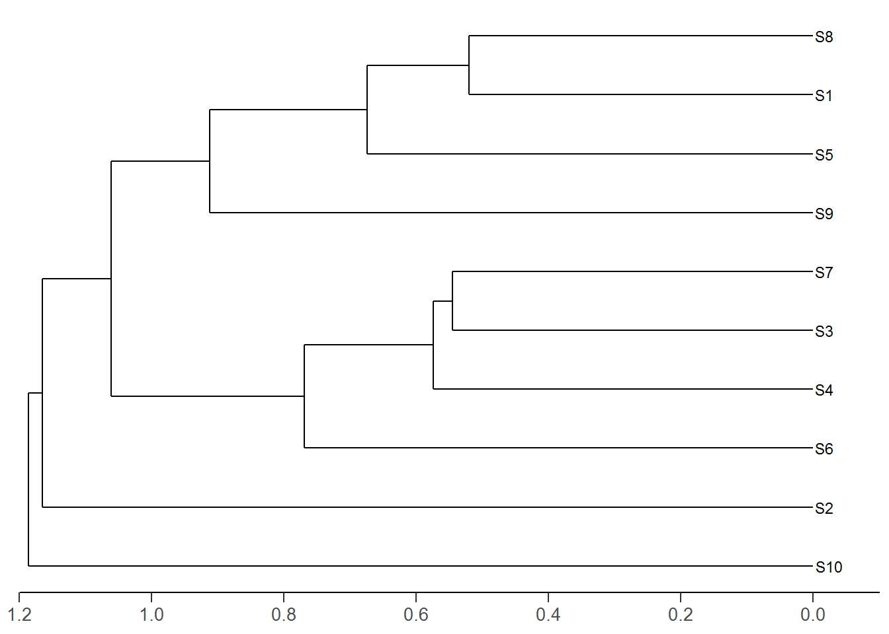
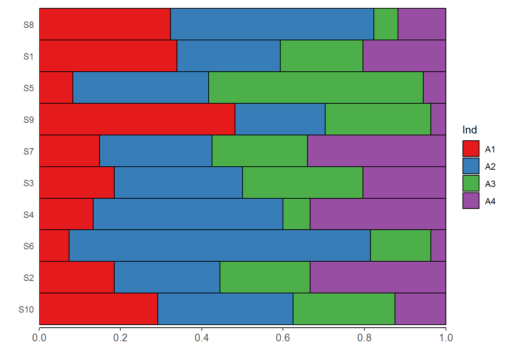

如何使用ggplot2包绘制聚类图和条形图的拼图？首先，该图肯定有左右两张图组成，于是就成了如何用ggplot2分别绘制左图和右图。左图实际上是聚类图，右图实际上是条形图。确定了思路，就好办了。

<!--more-->
有网友给我留言，如何绘制类似下述图形：


上述展示的图形，是我用ggplot2包绘制的，与网友提问的稍有区别，但已经很接近了。上面的图，如何实现呢？首先，该图肯定有左右两张图组成，于是就成了如何用ggplot2分别绘制左图和右图。左图实际上是聚类图，右图实际上是条形图。确定了思路，就好办了。

首先安装所需的程序包，为了便于绘制聚类图。
``` R
    install.packages('ggdendro')
``` 
## (0) 示例数据集

示例采用某位网友的数据集，该数据含有10个样地里168个物种的数量分布。
``` R
    spe <- read.csv("trees2017three.csv", row.names=1)
``` 
数据集部分的属性如下：
``` R
dim(spe)
## [1]  10 168
str(spe[,1:8])
## 'data.frame':    10 obs. of  8 variables:
##  $ 建始槭    : int  0 4 0 0 1 0 0 1 2 0
##  $ 巴东冷杉  : int  0 13 0 0 0 0 0 0 0 0
##  $ 白桦      : int  37 3 0 3 37 7 3 15 14 12
##  $ 白杨      : int  0 0 2 0 2 0 0 0 0 0
##  $ 板栗      : int  0 0 0 0 3 0 3 1 1 0
##  $ 包石栎    : int  0 0 0 3 0 0 0 3 0 0
##  $ 宝兴木姜子: int  5 0 0 7 0 0 0 9 0 0
##  $ 藏刺榛    : int  3 0 4 1 16 4 1 7 16 0
head(spe[,1:8])
##    建始槭 巴东冷杉 白桦 白杨 板栗 包石栎 宝兴木姜子 藏刺榛
## S1      0        0   37    0    0      0          5      3
## S2      4       13    3    0    0      0          0      0
## S3      0        0    0    2    0      0          0      4
## S4      0        0    3    0    0      3          7      1
## S5      1        0   37    2    3      0          0     16
## S6      0        0    7    0    0      0          0      4

``` 
(1)使用ggplot2包绘制聚类图
--------------------------

首先进行聚类数据的预处理，包括数据的归一化、欧式距离计算，然后进行UPGMA聚类，聚类结果转为dendrogram类，再借助ggdendro包的`dendro_data()`函数可以生成ggplot2包绘图所需的聚类图数据和标签数据：
``` R
    spe.norm <- vegan::decostand(spe, "normalize")
    spe.ch<- dist(spe.norm)#, method = "euclidean")
    spe.ch.UPGMA <- hclust(spe.ch, method="average")
    dend <- as.dendrogram(spe.ch.UPGMA)

    ddata <- ggdendro::dendro_data(dend, type = "rectangle")

    aa<-seq(1.2,0,by=-.2)  
``` 
aa向量的作用是用于标注距离的刻度。现在就可以使用ggplot2包进行进化树绘制。
``` R
    library(ggdendro)
    library(ggplot2)

    p1<-
      ggplot(segment(ddata)) + 
      geom_segment(aes(x = x, y = y, xend = xend, yend = yend)) + 
      coord_flip() + 
      theme(axis.title = element_blank(),
            axis.text.x = element_text(size=10),
            axis.line.x=element_line(),
            axis.text.y = element_blank(),
            axis.ticks.y=element_blank(),
            axis.ticks.length=unit(0.2,"cm"),
            panel.background=element_rect(fill="white"))+
      scale_y_reverse(limits =c(1.2,-0.1),expand = c(0, 0),breaks=aa)+
      geom_text(data=label(ddata),aes(x=x,y=y,label=label),size=3,hjust=-.1) 
``` 
代码说明：进化树数据在`segment(ddata)`中，分别含有x、y、xend和yend，通过`geom_segment()`绘制进化树。标签数据在`label(ddata)`，分别含有x、y和label,通过`geom_text()`添加标签。`segment()`、`label()`来自ggdendro包。


ok，进化树或聚类图基本成型。如果读者细心的话，会看到图下方的刻度超出0，我目前还没找到好的方法来解决该问题。在代码中，我设置让标签超出0，感兴趣的读者，可以自行研究。

(2) 使用ggplot2包绘制条形图
---------------------------

绘制右边的条形图，其实比较容易，但细心的读者，会发现条形图的y轴标签与进化树的一致，于是主要问题就成了如何将进化树的标签传递给绘制条形图的数据集里？
这里的m1数据集，是我随意模拟的一份数据集，只是为了演示的目的，没太多的科学意义，但不代码下述的绘图代码没有现实意义。首先，来看看数据的结构(请记住，任何时候查看并弄清数据的结构，都非常重要！)：
``` R
    head(m1)
    ##   sample Ind N0
    ## 1    S10  A1  7
    ## 2    S10  A2  8
    ## 3    S10  A3  6
    ## 4    S10  A4  3
    ## 5     S2  A1 10
    ## 6     S2  A2 14
    str(m1)
    ## 'data.frame':    40 obs. of  3 variables:
    ##  $ sample: Factor w/ 10 levels "S10","S2","S6",..: 1 1 1 1 2 2 2 2 3 3 ...
    ##  $ Ind   : chr  "A1" "A2" "A3" "A4" ...
    ##  $ N0    : int  7 8 6 3 10 14 12 18 2 20 ...
``` 
事实上，m1数据集为样地，样地内的某些指标(诸如多度、频度、重要值等，比例中随意拟合为A1到A4)及其相应数值。这里的样地sample就是之前进化树的标签。  
先看看ggplot2如何绘制条形图。
``` R
    aa1<-seq(0,1,by=.2)

    p2<-
      ggplot(data=m1, aes(x=sample, y=No, fill=Ind)) +
      geom_bar(stat="identity",width=1,color='black',
               position =position_fill(reverse=TRUE))+
      xlab('')+ylab('')+coord_flip()+
      scale_y_continuous(expand = c(0, 0),breaks=aa1)+ 
      theme(#axis.text.y = element_blank(),
            axis.text.x = element_text(size=10),
            axis.ticks.y=element_blank(),
            axis.line.x=element_line(colour="black"),
            panel.background=element_rect(fill="white")
            )
``` 
代码说明：这里的条形图，与常见的不同，用了x、y变量映射，X指定样地，y指定数值，Ind指定指标并用不同颜色填充。geom\_bar()中的参数`stat="identity"`，必须是这样的，因为我们要对x变量(即样地sample)指定y数值(No)。参数`reverse=TRUE`的作用是让图例与条形图的对应关系更直观，读者可以修改为`reverse=FALSE`，通过查看图形变化，即可明白。



条形图标签如何与进化树标签一致呢？实现代码如下：
``` R
    dend_labels <- label(ddata)$label

    #m1<-dplyr::arrange(m1,sample)
    m1$sample<- factor(m1$sample, levels = dend_labels)
``` 
代码说明：先获取进化树的标签，赋给向量dend\_labels，然后再将其传给m1数据集中样地sample的水平，并设为因子。如果m1未按样地排序，先通过dplyr包的arrange()排序后，再进行之前的因子数据转换。这个方法非常巧妙，也很好用！

最后，通过gridExtra包的grid.arrange()将上述两张图合并在一起，这个很简单：
``` R
    library(gridExtra)
    grid.arrange(p1,p2,nrow=1)
``` 
