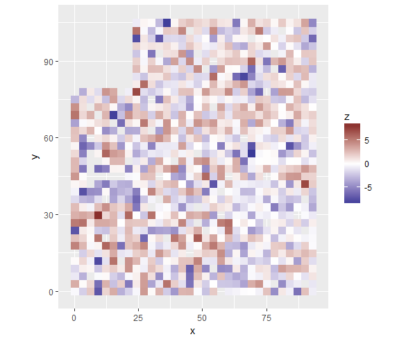
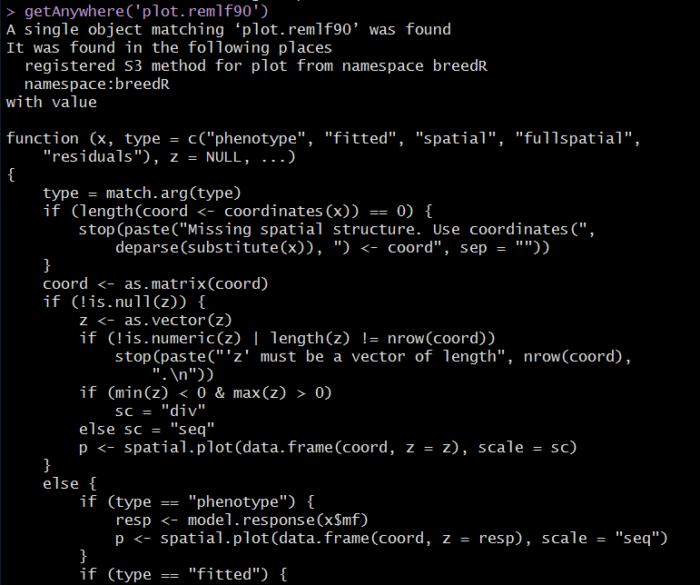
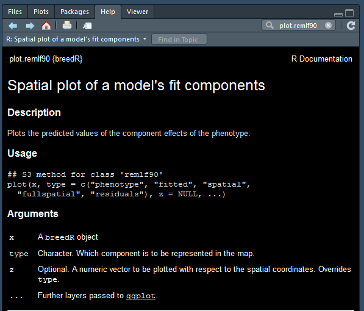

作者：林元震   


近年来，我参加了几次R培训的授课，也接触了不少R初学者。看到很多人对R很感兴趣，但学习起来却不得门道，着实着急。今天，我讲述自己如何学习R的一些个人体会，供R初学者参考。
<!--more-->

**首先，根据我个人学R的经历，参加培训不是学R必须的，另外，如果您曾参加过R培训，却未习得学R的方法，那么培训就浪费了！**

开篇之前，我想讲讲自己是如何接触R以及中国人民大学吴喜之老先生与R的故事。

1. 我最早接触R是2012年在澳洲访学时，老外告诉我有这么个东西，非常适用于数据处理、统计分析和图形绘制，而且免费。在澳洲访学时间只有一年，但上半年，已耗在所谓的GWAS(全基因组关联分析)。当时GWAS还很时髦，然而每天泡在无止境地反复提取DNA样本，使我厌倦，关键是回国之后，我也没有足够经费继续GWAS研究。于是，我选择退出，回到我华裔老板Harry Wu所在团队。老板当然开心，他是研究数量遗传学的，很少国内进修者愿意选择他的团队，往往都是通过他联系其他分子方向的团队。然后，开始接触R以及另一个很强大的商业软件ASReml。Wu老板很忙，告诉我，下半年他得在瑞典农业大学讲学，无暇管我，让我跟他的助手Milos学习。Milos，来自南斯拉夫，人高大也很nice，但是不会教我使用R与ASReml。我被告知，只能自学，有问题可以问他。不到半年的时间，要学习R和ASReml！R倒还好，但ASReml非常难，光使用手册接近500页！而且Milos还不提供任何示例数据，要我自己做实验获取数据。于是，在他的指导下，花了近1个月时间，涉及实验设计与试验操作流程，然后，实验大概又用掉了1个月时间。再刨去回国前的半个月时间，留给我的学习时间，只有3个月半！刚开始时，不论是R还是ASReml，都很痛苦，代码在哪输入，程序如何运行，都不知道。还好，Milos可以演示，仅仅演示而已。于是，自己慢慢摸索。无数个凌晨1、2点，我还在电脑前，研究如何修改模型代码与程序运行。还好，很快自己就摸到学习的门道，慢慢开始轻车熟路。Wu老板团队里，有个老黑，其名washington，听说我要自学ASReml，他不以为然，说他参加了至少3次培训。事实证明，**<span style="color:red">兴趣是最好的老师</span>**，你可以不参加任何培训，凭借兴趣，一样可以学会。提前透露使我很快入门的秘籍：**<span style="color:red">合理的数据和检索的技巧</span>**。回国之后，我用不了不到3个月时间，编了第一本书《R与ASReml-R统计分析教程》，编书的初衷是没想到国内林业从事者的统计分析能力偏弱还保守。澳洲老板没想到我还出书，也欣然为我书做序。2年之后，我再次升级第一版至第二版《R与ASReml-R统计学》，书厚了一倍，编书时间大致也就3个月。我的个人经历说明，即便你是一个R的小白，你也可以学好R、用好R，还可以编写R教材，如果你愿意分享的话。

2. 中国人民大学统计学知名教授吴喜之老先生七十岁左右才开始接触R，一个月后，就可做到R编程自如。固然，吴老先生是从事统计学的，也用过SAS等软件，但其七十岁时仍坚持学习新软件—R，这种学到老活到老的精神值得我们年轻人学习。看看吴老先生的例子，如果你真学习R，是不是应该内心充满满满的正能量？这个例子，我也经常告诉我的学生们。

对于初学者，推荐几本参考书非常有必要。**<span style="color:red">《R语言实战(2nd)》</span>**被称为R界文献的圣经，足见其分量，但价格不菲；**<span style="color:red">《R语言核心技术手册》</span>**也是不错的参考书，可以学到很多基本功，就如习武者，必练基本功，当然书价也不低；**<span style="color:red">《R数据可视化手册》</span>**是ggplot2包制图的攻略，可以让读者很快入门ggplot2绘制各种常见图形，只惜书价不美丽；最后推荐我主编的书**<span style="color:red">《R与ASReml-R统计学》</span>**，本书集成数据管理、数据统计、图形绘制和混合线性模型分析，仅高级图形绘制就包含lattice包和ggplot2包的使用章节，书价相对而言，合理很多。个人觉得，可以作为R初学者的一个补充材料，货真价实。

- [x] [林元震主编.《R与ASReml-R统计学》.中国林业出版社.2017.](https://www.amazon.cn/dp/B071988MHV/ref=sr_1_1?ie=UTF8&qid=1531449024&sr=8-1&keywords=R%E4%B8%8EASReml-R%E7%BB%9F%E8%AE%A1%E5%AD%A6)
- [x] [Robert.《R语言实战(2nd)》.人民邮电出版社.2016.](https://www.amazon.cn/dp/B01FSXCBMS/ref=sr_1_1?ie=UTF8&qid=1531448793&sr=8-1&keywords=R%E8%AF%AD%E8%A8%80%E5%AE%9E%E6%88%98)
- [x] [Joseph.《R语言核心技术手册》.电子工业出版社.2014.](https://www.amazon.cn/dp/B00MMU65H8/ref=sr_1_1?ie=UTF8&qid=1531449157&sr=8-1&keywords=R%E8%AF%AD%E8%A8%80%E6%A0%B8%E5%BF%83%E6%8A%80%E6%9C%AF%E6%89%8B%E5%86%8C)
- [x] [Winston Chang著《R数据可视化手册》.2014.](https://www.amazon.cn/dp/B00JRQV5QQ/ref=sr_1_1?ie=UTF8&qid=1531449110&sr=8-1&keywords=R%E6%95%B0%E6%8D%AE%E5%8F%AF%E8%A7%86%E5%8C%96%E6%89%8B%E5%86%8C)

我在《R与ASReml-R统计学》书中提到如何有效学习R，大致有以下6点：   
* <span style="color:red">熟悉语法</span>。任何一门编程语言都有其语法，R也不例外，语法必须学习。   
* <span style="color:red">训练思维</span>。与其它编程语言类似，R编程也需要严谨的逻辑思维。    
* <span style="color:red">熟能生巧</span>。学习任何新东西，都有一个模仿过程，R也是如此。    
* <span style="color:red">善于求助</span>。R拥有庞大的社区论坛和全球用户，通过求助方式学习也是提高R能力的有效途径之一。    
* <span style="color:red">不怕犯错</span>。犯错是R学习进步的捷径。回顾笔者自学R的过程，就是在不断犯错中前进的，每一次犯错然后纠错就是一次进步。     
* <span style="color:red">保持兴趣</span>。兴趣是最好的老师，只要坚持R的求知欲，持之以恒，一定会有成效。      

上述几点，是通用法则，学习任何软件都存在相似情况。下面讲讲，对于R初学者，应该如何从零开始。

第一、下载安装[R](https://mirrors.eliteu.cn/CRAN/)软件。同时，建议下载安装[Rstudio](https://www.rstudio.com/products/rstudio/download/)软件，都是免费。RStudio是一个非常优秀的R语言操作界面。RStudio与R语言相似，可以在各种操作系统(Windows，Mac，或者Linux)中运行。RStudio可以让R语言代码更直观、明了地运行。至于如何在R或Rstudio输入代码，这里不讲，可以参阅《R与ASReml-R统计学》或者其它网络资源。     


第二、R的强大之处在于拥有非常广泛且数量惊人的外延程序包packages。截至2018年7月13日，在CRAN社区上可使用的程序包就有12747个，还不包括[BioCondutor](https://www.bioconductor.org/)和[R-Forge](https://r-forge.r-project.org/)网站的程序包。外延的程序包`packages`需要通过命令 `install.packages()`进行安装，例如安装`stringi`，下面两种方法都可以，一般使用第一种情况，如果失败了，再考虑第二种方法。注意type参数除了'win.binary'，也可以是'mac.binary'，根据电脑系统而定。

```r
install.packages("stringi")
install.packages("stringi", type = 'win.binary')
```
* <span style="color:red">对于R初学者，不建议安装太多的程序包!</span>

第三、要参透R的强大主要是程序包的<span style="color:red">函数</span>来实现各种数据处理、统计分析以及图形绘制。因此学R就是学R函数。函数也都是针对数据而言，换言之，如果没有数据，也就无需谈论R。于是，**<span style="color:red">了解数据及其结构是第一要务</span>**。

`(1)` 学习函数data()的功能。好的程序包往往都有内置数据集，因此可以通过示例数据学习程序包内的各种函数。

```r
data() # 查看R内置数据集
data( package = 'ggplot2') # 查看ggplot2包内数据集
data("diamonds", package = 'ggplot2') # 调用diamonds数据集
```
     
`(2)` 查看数据的结构，主要是数据变量、类型及部分子集。

```r
data("diamonds", package = 'ggplot2') # 调用diamonds数据集
names(diamonds) # 数据集变量
str(diamonds)   # 数据集结构
class(diamonds) # 数据集属性
dim(diamonds)   # 数据集维度
head(diamonds)  # 数据集头6行
tail(diamonds)  # 数据集末6行
```
* 对于R初学者，上述命令非常有必要，尤其在学习使用新函数时。   

`(3)` 读取外部数据。

```r
setwd('D:/Rdata') # 设置路径在文件夹D:\Rdata。
df <- read.csv( file = 'dat.csv', header = TRUE )
```
* 对于R初学者，建议在D盘新建文件夹Rdata，然后上述的`setwd('D:/Rdata')`就可直接使用。 

`(4)` 学会查看函数及其使用条件。     

```r
library(breedR)

data("globulus")
dat <- globulus

gen.dat <- list(model = 'add_animal',
                pedigree = dat[,1:3],
                id = 'self')

# 运行模型，结果存为对象blkM.bdR
blkM.bdR <- remlf90(
  fixed = phe_X ~ gg,
  genetic = gen.dat,
  spatial = list(model = 'blocks',
                 coord = dat[, c('x','y')],
                 id = "bl"),
  dat = dat)


plot(blkM.bdR, 'residuals')
```
通过上述的简短plot()代码即可绘图，但这不代表我们可以随意传递一份数据给plot()就能得到类似图形。


因此，应该了解模型运行结果blkM.bdR的属性，通过class()和mode()运行结果可知，blkM.bdR属性为breedR和remlf90，并且数据结构是列表list。
```r
class(blkM.bdR)
[1] "breedR"  "remlf90"
mode(blkM.bdR)
[1] "list"
```

事实上，plot()函数是一个泛函数，即其包含很多子函数，命名为plot.XX()，XX一般为子函数的类，通过methods(plot)可以查看到具体的子函数，也可找到上述示例的子函数为plot.remlf90。
```r
 methods(plot)
 [1] plot,ANY,ANY-method                        plot,color,ANY-method                     
 [3] plot,Spatial,missing-method                plot,SpatialGrid,missing-method  
 ...
 [61] plot.raster*                              plot.remlf90*    
 ...
```
如果想要查看plot.remlf90()的具体代码，只需输入`getAnywhere('plot.remlf90')`即可。   


通过plot.remlf90()函数代码，可知与上述图形的相关代码部分如下：
```r
function (x, type = c("phenotype", "fitted", "spatial", "fullspatial", 
    "residuals"), z = NULL, ...) {
  ...  
  type = match.arg(type)
  coord <- coordinates(x))
  if (type == "residuals") {
    p <- spatial.plot(data.frame(coord, z = residuals(x)), 
                       scale = "div")
  }
  ...
}
```

如果想要知道如何使用plot.remlf90()，只需输入`?plot.remlf90`即可搜到其用法：         


对于R初学者的忠告，**<span style="color:red">学R是一个过程，不要急功近利得学！</span>**慢慢参透数据结构和函数里数据属性与使用条件。只要领会了这点，并学会有技巧地检索问题，R的学习很快就会成为一种乐趣！

关于检索，多说一句，google国内不能用，有点遗憾，但可以使用[yahoo](www.yahoo.com)，并且尽量使用英文，例如`ggplot2 map in R`。   

