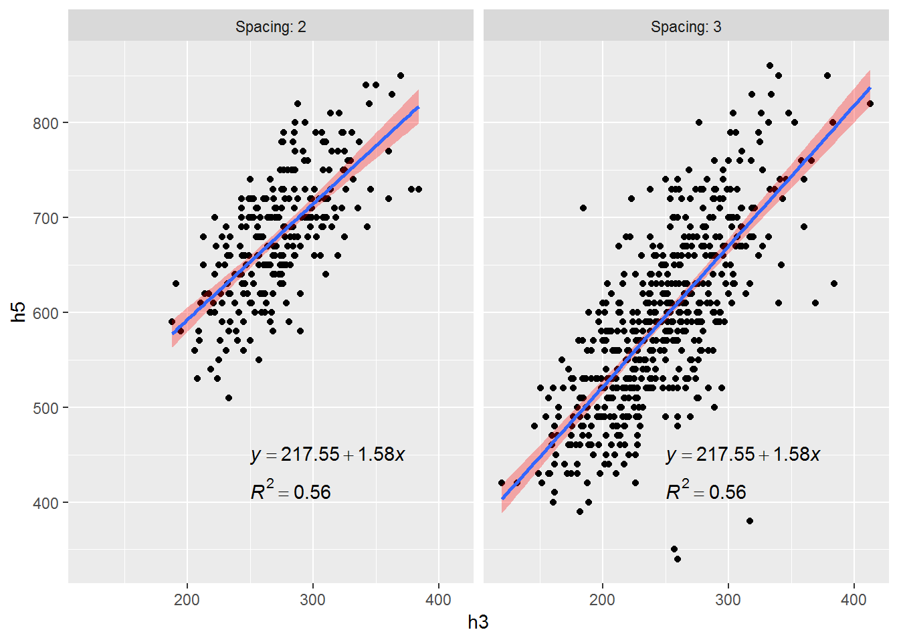

巧用plyr包可以实现很多情况下的批量分析。如果手头经常需要重复运行某些类似程序，就可以编个函数和dplyr包一起使用，达到事半功倍。

<!--more-->
(1)使用plyr包思路的来源
-----------------------

在我主编的《R与ASReml-R统计学》第422~424页，演示了在ggplot2包绘制的分面图上批量添加回归方程，具体例子如下：
```r
    lm_labels <- function(dat) {
      mod <-lm(h5 ~ h3, data=dat)
      formula <-sprintf("italic(y) == %.2f %+.2f * italic(x)",
                        round(coef(mod)[1],2), round(coef(mod)[2],2))
      r <-cor(dat$h5,dat$h3,use="pairwise")
      r2 <- sprintf("italic(R^2) == %.2f", r^2)
      data.frame(formula=formula,r2=r2,stringsAsFactors=FALSE)
    }  

    # library(plyr)

    data(dfm,package='RSTAT2D')
    labels <- plyr::ddply(dfm,"Spacing",lm_labels)  

    labels <- lm_labels(dfm) 

    # library(ggplot2)
    ggplot(dfm,aes(x=h3,y=h5))+ geom_point() +
      facet_wrap(~Spacing, labeller=label_both)+ 
      geom_smooth(method=lm, se=TRUE,fill='red',alpha=.3) +
      geom_text(x=250,y=450,aes(label=formula), data=labels, parse=TRUE,hjust=0) +
      geom_text(x=250,y=415,aes(label=r2),data=labels,parse=TRUE,hjust=0)
```


上述图形实现的思路是，编一个函数lm\_labels()进行目标数据的线性回归并返回线性方程及其R2，然后通过plyr包的ddply()对分组变量或因子Spacing进行函数lm\_labels()的运算，最后返回一个数据框labels。labels含有注释所需的所有信息，再通过geom\_text()添加到图形中。

那么能否运用到模型的批量计算呢？从思路上来说，应该行得通。于是就试试混合线性模型。结果是，当然可以运行。

(2) plyr包进行线性混合模型的批量分析
------------------------------------

下文将使用nlme、lme4、asreml和breedR包分别进行演示，部分代码在上述程序包均为相似，因此先编一个小函数，用于数据的变换，即2行
× N行的数据框转换为1行排列。
```r
    # function change data frame (2 X N) into one line
    mf.tr <- function(df) {
      df<-as.data.frame(df)
      df<-df[sort(names(df))]
      nn<-ncol(df)
      res.ls<-data.frame(ls=NA)
      res.ls[,1:nn]<-round(df[1,],3) 
      res.ls[,(nn+1):(2*nn)]<-round(df[2,],3)
      
      NVar<-colnames(df)
      NVar.se<-paste(NVar,'se',sep='.') 
      names(res.ls)<-c(NVar,NVar.se)
      
      return(res.ls)
    }
```
### (2.0) 示例数据集

示例采用agridat包的数据集butron.maize，该数据含有个体、双亲、地点和产量等5个变量，为了批量分析，特意模拟一个正态分布的变量x。
```r
data(butron.maize,package='agridat')
str(butron.maize)
## 'data.frame':    245 obs. of  5 variables:
##  $ gen   : Factor w/ 49 levels "A509xA637",..: 1 2 3 4 5 6 7 8 9 10 ...
##  $ male  : Factor w/ 9 levels "A509","A637",..: 1 1 1 1 1 1 1 1 1 2 ...
##  $ female: Factor w/ 9 levels "A637","A661",..: 1 2 3 4 5 6 7 8 9 2 ...
##  $ env   : Factor w/ 5 levels "pc95","pc96",..: 3 3 3 3 3 3 3 3 3 3 ...
##  $ yield : num  6.81 5.02 7.39 6.84 6.04 7.1 4.37 5.89 4.48 7.02 ...

    butron.maize1<-tidyr::unite(butron.maize,col=Fam,2:3,sep='.')

    butron.maize2<-dplyr::left_join(butron.maize,butron.maize1,
                                      by=c('gen','env','yield'))

    set.seed(2018)
    butron.maize2$x<-rnorm(245,mean=10,sd=4)

# 将需要的分析性状yield和x整合到变量Trait下，
# 将yield和x对应的数值整合到变量y下，
# 以便使用plyr的ddply()通过Trait进行批量分析
df<-tidyr::gather(butron.maize2,key=Trait,y,c(-1:-4,-6))
str(df)
## 'data.frame':    490 obs. of  7 variables:
##  $ gen   : Factor w/ 49 levels "A509xA637",,..: 1 2 3 4 5 6 7 ...
##  $ male  : Factor w/ 9 levels "A509","A637",..: 1 1 1 1 1 1 1 1 1 2 ...
##  $ female: Factor w/ 9 levels "A637","A661",..: 1 2 3 4 5 6 7 8 9 2 ...
##  $ env   : Factor w/ 5 levels "pc95","pc96",..: 3 3 3 3 3 3 3 3 3 3 ...
##  $ Fam   : chr  "A509.A637" "A509.A661" "A509.CM105" "A509.EP28" ...
##  $ Trait : chr  "yield" "yield" "yield" "yield" ...
##  $ y     : num  6.81 5.02 7.39 6.84 6.04 7.1 4.37 5.89 4.48 7.02 ...
```
### (2.1) 与nlme包结合使用

首先，编写nlme包做线性混合分析的通用函数，具体代码如下：
```r
    nlme.batch <- function(data,FMod,RMod){
      # nlme V3.1-127
      nlm<-nlme::lme(FMod,random=RMod,data=na.omit(data))
      
      Var<-VarCorr(nlm)
      suppressWarnings(storage.mode(Var) <- "numeric")
      vc<-Var[!is.na(Var)]
      Var1<-matrix(vc,nrow=2,byrow=T)
      
      RFN<-rownames(Var)
      RFN<-RFN[RFN!="(Intercept)"]
      RFN1<-gsub(" =",'',RFN)
      colnames(Var1)<-RFN1
      
      res.ls<-mf.tr(Var1)
      
      return(res.ls)
    }
```
现在使用已经构建的数据集df和函数nlme.batch()来试试批量分析，当然使用函数nlme.batch()前，需要指定模型的固定效应和随机效应，具体示例如下：
```r
    # 固定效应
    Fixed.Mod= y ~ 1+env

    # 随机效应
    Ran.Mod=~1|male/female/Fam

    #library(nlme)
    sp1<-plyr::ddply(df,'Trait',
              function(df) nlme.batch(data=df,FMod=Fixed.Mod,RMod=Ran.Mod))
```
固定项`Fixed.Mod= y ~ 1+env`，因为目标变量yield和x的数值现在都已整合入变量y中。随机项`Ran.Mod=~1|male/female/Fam`表示含有3个随机效应，分别为male、female和Fam。由于nlme无法直接识别male:female，因此利用tidyr包的unite()创建变量Fam，指定其为male和female的组合。这样处理数据时，应当注意双亲是完全不同的。本例中，这样处理没有问题，原因如下：
```r
table(df$male,df$female)
##        
##         A637 A661 CM105 EP28 EP31 EP42 F7 PB60 Z77016
##   A509    10   10    10   10   10   10 10   10     10
##   A637     0   10    10   10   10   10 10   10     10
##   A661     0    0    10   10   10   10 10   10     10
##   CM105    0    0     0   10   10   10 10   10     10
##   EP28     0    0     0    0   10   10 10   10     10
##   EP31     0    0     0    0    0   10 10   10     10
##   EP42     0    0     0    0    0    0 10   10     10
##   F7       0    0     0    0    0    0  0   10     10
##   PB60     0    0     0    0    0    0  0    0     10
```
因为nlme.batch()函数返回数据框，无法直接查看结果，因此再运行sp1，即可看到方差分量结果：
```r
sp1
##   Trait   Fam female  male Residual Fam.se female.se male.se Residual.se
## 1     x 0.270  0.270 0.359   15.466  0.520     0.520   0.599       3.933
## 2 yield 0.231  0.231 0.493    0.570  0.481     0.481   0.702       0.755
```
### (2.2) 与lme4包结合使用

首先，编写lme4包做线性混合分析的通用函数，具体代码如下：
```r
    lme4.batch <- function(data,Mod){
      # lme4 V1.1-13
      lme<-lme4::lmer(Mod,data=data)
      
      Var<-as.data.frame(summary(lme)$varcor)[,-2:-3]
      row.names(Var)<-Var[,1]
      Var<-Var[,-1]
      Var<-as.data.frame(t(Var))
      
      res.ls<-mf.tr(Var)
      
      return(res.ls)
    }
```
现在使用函数lme4.batch()来试试批量分析，但需要注意lme4指定模型的固定效应和随机效应不同于多数R包的格式，其并未将固定效应与随机效应分开，且以`(1|male)`表示随机效应，具体示例如下：
```R
    # 固定效应和随机效应
    Mod= y ~ 1+env+(1|male)+(1|female)+(1|Fam)
    #Mod= y ~ 1+env+(1|male)+(1|female)+(1|male:female)

    # library(lme4)
    sp2<-ddply(df,'Trait',
              function(df) lme4.batch(data=df,Mod))
```
因为lme4.batch()函数返回数据框，无法直接查看结果，因此再运行sp2，即可看到方差分量结果：
```r
sp2
##   Trait   Fam female  male Residual Fam.se female.se male.se Residual.se
## 1     x 0.540  0.000 0.359   15.466  0.735     0.000   0.599       3.933
## 2 yield 0.194  0.256 0.587    0.570  0.440     0.506   0.766       0.755
```
### (2.3) 与asreml包结合使用

首先，编写asreml包做线性混合分析的通用函数，具体代码如下：
```r
    asr0.batch <- function(data,FMod=NULL,RMod=NULL,EMod=NULL){
      
      if(is.null(EMod)) EMod=~ units
      
      # asreml V3.0
      asr<-asreml::asreml(fixed=FMod, random=RMod, rcov=EMod,
                           na.method.X='include',
                           data=data, trace=FALSE)
      
      Var<-t(summary(asr)$varcomp[,2:3])
      Var<-as.data.frame(Var)
      
      res.ls<-mf.tr(Var)
      
      return(res.ls)
    }
```
现在使用函数asreml()来试试批量分析，具体示例如下：
```r
    FMod1=y~ 1+env
    RMod1=~male+female+Fam
    #RMod1=~male+female+male:female

    library(asreml)
    sp3<-ddply(df,'Trait',
               function(df) asr0.batch(data=df,FMod=FMod1,
                                       RMod=RMod1))
```
因为asr0.batch()函数返回数据框，再运行sp3，即可看到方差分量结果：
```r
sp3
##   Trait Fam!Fam.var female!female.var male!male.var R!variance
## 1     x       0.386             0.000         0.357     15.771
## 2 yield       0.204             0.267         0.578      0.581
##   Fam!Fam.var.se female!female.var.se male!male.var.se R!variance.se
## 1          0.823                0.000            0.576         1.593
## 2          0.085                0.179            0.348         0.059
```
由于asreml对结果的注释比较仔细，因此结果看起来不太好看，可以再进行对上述结果做命名的变换，示范如下：
```r
    nn<-names(sp3)
    nn1=nn2=NULL
    for(i in 1:5) {
      nn1[i]<-strsplit(nn[i],'!')[[1]][1]
      nn2[i]<-nn1[[i]][1]
    }
    nn2<-nn2[-1]
    nn2.se<-paste(nn2,'se',sep='.')
    names(sp3)[-1]<-c(nn2,nn2.se)
```
现在结果格式与之前的两个包相似。关于asreml返回变量名称的修改，更明智的做法是在asr0.batch()函数进行修改，因为它是通用函数。
```r
sp3
##   Trait Fam!Fam.var female!female.var male!male.var R!variance
## 1     x       0.386             0.000         0.357     15.771
## 2 yield       0.204             0.267         0.578      0.581
##   Fam!Fam.var.se female!female.var.se male!male.var.se R!variance.se
## 1          0.823                0.000            0.576         1.593
## 2          0.085                0.179            0.348         0.059
```
下述是我修改后的通用函数asr1.batch()，就可得到比较直观的结果:
```r
    sp3b<-ddply(df,'Trait',
               function(df) asr1.batch(data=df,FMod=FMod1,RMod=RMod1))

sp3b
##   Trait   loglik     AIC  male female   Fam   Rvar male.se female.se
## 1     x -464.990 937.980 0.357  0.000 0.386 15.771   0.576     0.000
## 2 yield -102.554 213.108 0.578  0.267 0.204  0.581   0.348     0.179
##   Fam.se Rvar.se converge
## 1  0.823   1.593     TRUE
## 2  0.085   0.059     TRUE           
```
综上所述，巧用plyr包可以实现很多情况下的批量分析。如果手头经常需要重复运行某些类似程序，就可以编个函数和dplyr包一起使用，达到事半功倍。虽然，上述程序看起来还算不错，但遗憾的是，**好像不能用于多性状的批量分析**，即只能用于单性状的批量分析。asreml的多性状批量分析，还是只能使用我的老办法`asreml.batch`,对此感兴趣者可以查看[本人科学网博客](http://blog.sciencenet.cn/blog-1114360-1079502.html)。
