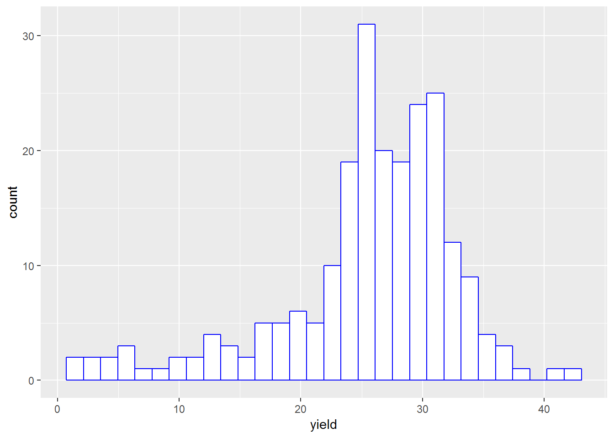
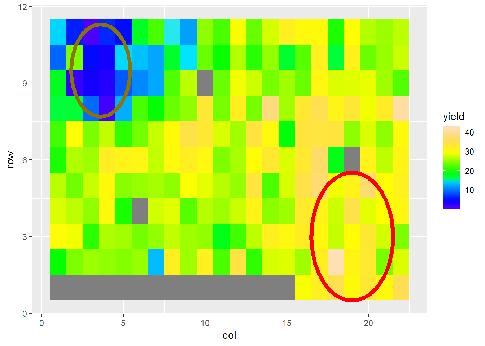
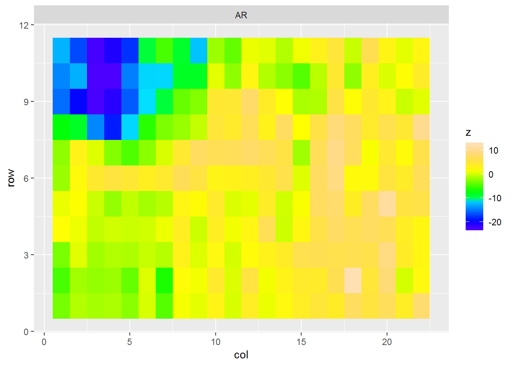
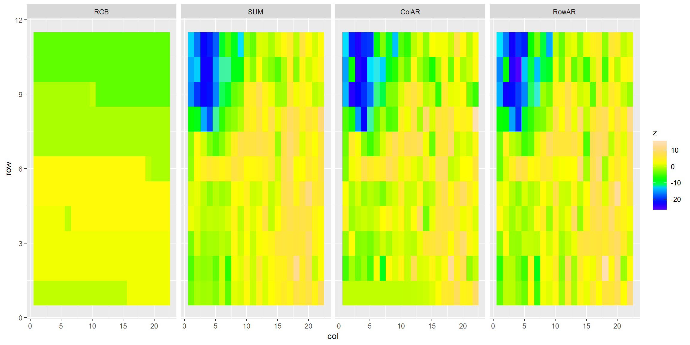

前言：前段时间，因疫苗问题闹得沸沸扬扬，这是非常严重的问题，关乎民生，国家应该彻查。因违法惩罚偏低，使得部分奸商为利铤而走险，不顾百姓健康。常言道，出来混的，迟早要还！我愿相信国家会在法制上想法制止这种损人利己的投机倒把。国人好斗，早已深入人心，诸如四大名著，哪部不言斗？啥时国人能跟数据好好斗斗？如果数据是原料，统计方法就是菜谱。理论上，给定一些原料，应该会得到一份合适的最佳菜谱。同理，对于给定一份数据，理论上也应有最合适的统计方法。不同统计方法，得到的结果可能会相差万里。因此，若要从事严谨的科研生产，应当关注相关行业的最新统计方法。懒散得随意分析生产数据，是一种罪过，也是对事业的不尊重，还是对人生的不尊重。今天演示的空间分析，即会看到最佳菜谱的重要性。

<!--more-->

空间分析(spatial analysis)现已成为农林业遗传评估的常见方法之一，但其最早提出者竟是一位医生^[1]，这出乎我的意料。话说1840s末期，伦敦爆发了严重的霍乱疫情，死了不少人。主流理论认为霍乱通过“肮脏的空气”传染的，这错误理论导致霍乱未能得到有效控制。伦敦皇家外科医学院有位医生，名叫John
Snow，虽然年纪轻轻但已事业有成，他不认同霍乱传染的主流理论，他认为水里携带的细菌才是主因。他用几年时间，走遍伦敦进行详细调研和病情记录，绘制了如下的点图：


最后，Snow将传染源锁定在一个公共抽水机，并说服政府将抽水机挪走。因为当时泰晤士河已被污染，然后通过抽水机传播霍乱。当年Snow锁定的抽水机，现已成了伦敦的地标之一：


Snow调查表明疾病的发病率跟地理位置是相关的，这就是空间分析方法的始祖。可惜，Snow英年早逝，四十多岁就累死了。

牛人已去，历史继续。Snow肯定没想到他的方法，被后人广泛运用到诸多行业，比如农林业上。现在介绍农林业上应用的空间分析原理及其示例。

1 空间分析的基本原理
--------------------

遗传评估分析的通用混合线性模型如下：
$$y=xb+zu+e$$

对于空间分析^[2]，将上式中的误差e进一步分解为e = ξ + η。ξ为空间相关的误差，η为空间不相关的随机误差。η反应了微环境差异、非加性遗传效应以及测量误差。 
    
 Authur等(1997)将ξ设为行、列的自回归AR1$\otimes$AR1，因此其方差协方差矩阵为：

$$Var(\xi) = \sigma_\xi^2 [Σ_c(ρ_c) \otimes Σ_r(ρ_r)]$$       
     
 其中，$\otimes$为矩阵的Kronecker积(kronecker product)，$Σ_c(ρ_c)、Σ_r (ρ_r)$为列、行的回归矩阵，列、行自回归参数分别为$ρ_c、ρ_r$。   
   
 $Σ_c(ρ_c)$回归矩阵具体如下：

$$
 \left( \begin{array}{ccc}
    1 & ρ_c & ρ_c^2 & \ldots  & ρ_c^{c-1} \\
    ρ_c & 1 & ρ_c & \ldots  & \vdots \\
    ρ_c^2 & ρ_c & 1 & \ldots  & \vdots \\
    \vdots & \vdots & \vdots & \ddots & \vdots \\
    ρ_c^{c-1} & \vdots & \vdots & \ldots  & 1
\end{array} \right)
$$


 $Σ_r(ρ_r)$回归矩阵具体如下:

 $$
 \left( \begin{array}{ccc}
    1 & ρ_r & ρ_r^2 & \ldots  & ρ_r^{r-1} \\
    ρ_r & 1 & ρ_r & \ldots  & \vdots \\
    ρ_r^2 & ρ_r & 1 & \ldots  & \vdots \\
    \vdots & \vdots & \vdots & \ddots & \vdots \\
    ρ_r^{r-1} & \vdots & \vdots & \ldots  & 1
\end{array} \right)
$$

假定η随机误差是独立的，则误差方差协方差矩阵为：
$$Var(e) = \sigma_\xi^2 [Σ_c(ρ_c) \otimes Σ_r(ρ_r)] + \sigma_\eta^2I$$       
     

其中，$\sigma_\xi^2$是空间相关的误差，$\sigma_\eta^2$是独立的误差，I是单位矩阵。

数学公式不少，部分读者估计已经懵了。空间分析原理通俗点说，正如古人所言的‘近朱者赤，近墨者黑’，拿试验林为例，就是部分林地内树木都表现良好，而部分林地下却总体表现差，于是问题就来了，这些局部表现优秀或低劣的树木，到底是因为所处的微环境(比如光照、土壤养分等)还是其自身的基因型造成的？这里面事实上有两种情况：一种是基因型优秀的，但运气欠佳，落到了贫瘠的土壤里，成了‘怀才不遇型’；另一种是基因型低劣的，但运气爆棚，落到了肥沃的土壤里，成了‘滥竽充数型’。因此，空间分析就是要纠正这两种情况，通过空间自相关或者其它途径。有趣的是，基因型优秀或者低劣，是相对于试验环境而言的，即某个基因型在一种试验环境中是优秀的，但到了另一种试验环境中可能就成了低劣型。这属于基因型与环境互作的问题，本文不作这方面的分析。

现在来看看在R中如何使用breedR包进行空间分析的演示，虽然asreml包更强大，但由于它是商业软件，且费用不低，因此本文不打算介绍asreml。

2 空间模型的分析示例
--------------------

首先载入所需程序包
``` R
    library(breedR)
    library(breedRPlus)
    library(ggplot2)
``` 
## (2.0) 示例数据集

示例采用agridat包的数据集stroup.nin，该数据含有小麦基因型gen、区组rep、产量yield、列号col和行号row等5个变量。
``` R
    data(stroup.nin,package='agridat')
    dat <- stroup.nin
``` 
数据集的变量及其特征：
``` R
names(dat)
## [1] "gen"   "rep"   "yield" "col"   "row"
str(dat)
## 'data.frame':    242 obs. of  5 variables:
##  $ gen  : Factor w/ 56 levels "Arapahoe","Brule",..: 12 12 12 12 ...
##  $ rep  : Factor w/ 4 levels "R1","R2","R3",..: NA NA NA NA NA  ...
##  $ yield: num  NA NA NA NA NA NA NA NA NA NA ...
##  $ col  : int  1 2 3 4 5 6 7 8 9 10 ...
##  $ row  : int  1 1 1 1 1 1 1 1 1 1 ...
``` 
目标性状yield的直方图(Fig.1)和空间趋势(Fig.2)如下：
``` R
    ggplot(dat, aes(yield)) + geom_histogram(col='blue',fill='white')
``` 


<p class="caption">
Fig.1 目标性状yield的直方图
</p>

``` R
    ggplot(dat, aes(row, col, fill = yield)) +
      geom_tile(show.legend = TRUE) +
      coord_fixed() + coord_flip()+
      scale_fill_gradientn(colours = topo.colors(50))
``` 


<p class="caption">
Fig.2 目标性状yield的空间趋势
</p>

(2.1)分析模型
-------------

### (2.1.1) 模型1–RCB模型

首先采用原本的试验设计–随机完全区组设计(RCB)，进行数据分析。由于数据要针对基因型的品种表现作评估与比较，因此将其作为固定效应。具体代码如下：
``` R
    ## M1:RCB model
    RCB.bdR <- remlf90(fixed = yield ~ 1+gen,
                       random = ~ rep,
                       data = dat)
``` 
RCB模型的方差分量以及Loglook与AIC值如下：
``` R
breedRPlus::var(RCB.bdR)
##              gamma component std.error  z.ratio constraint
## rep      0.1993244    9.8829    8.7928 1.123976   Positive
## Residual 1.0000000   49.5820    5.4588 9.082949   Positive

summary(RCB.bdR)$model.fit[c(1,3)] 
##       AIC    logLik
##  1253.938 -624.9691
``` 
此外，breedR允许将区组放入空间分析方法中，但结果与RCB的一样。分析代码如下：
``` R
    ## M1b:RCB model
    RCB1.bdR <- remlf90(fixed = yield ~ 1+gen,
                        spatial = list(model = 'blocks',
                                       coord = dat[, c('row','col')],
                                       id = "rep"),
                        data = dat)
``` 
RCB1模型的方差分量以及Loglik与AIC值如下：
``` R
var(RCB1.bdR)
##              gamma component std.error  z.ratio constraint
## spatial  0.1993244    9.8829    8.7928 1.123976   Positive
## Residual 1.0000000   49.5820    5.4588 9.082949   Positive

summary(RCB1.bdR)$model.fit[c(1,3)] 
##       AIC    logLik
##  1253.938 -624.9691
``` 
### (2.1.2) 模型2–SUM空间模型

现在进行空间模型分析，由于breedR包不能设定，$\sigma_\eta^2$=0，因此它无法进行仅含有空间相关误差的模型，这与asreml相比，多少有点遗憾，但对于初学者，这却是优点！下面展示行列均相关的空间分析模型，具体代码如下：
``` R
    ## M2:AR1 X AR1 + units model

    SUM.bdR <- remlf90(fixed = yield ~ 1+gen,
                        spatial = list(model = 'AR',
                                       coord = dat[,c('row','col')],
                                       rho =c(.66,.44)),
                        data = dat)
``` 
SUM模型的方差分量以及Loglik与AIC值如下：
``` R
var(SUM.bdR)
##             gamma component std.error  z.ratio constraint
## spatial  6.459346   35.7570    6.8376 5.229466   Positive
## Residual 1.000000    5.5357    2.5391 2.180182   Positive

summary(SUM.bdR)$model.fit[c(1,3)] 
##       AIC    logLik
##  1147.881 -571.9406
``` 
SUM模型的空间相关误差趋势图如下：
``` R
    plot(SUM.bdR, type = 'spatial')+coord_flip()+
      scale_fill_gradientn(colours = topo.colors(50))
``` 


<p class="caption">
Fig.3 SUM模型的空间相关误差趋势图
</p>

### (2.1.3) 模型3–ColAR空间模型

现在设定只有列存在空间相关，即行之间不存在自相关。代码如下：
``` R
    ## M3:ID X AR1 + units model

    ColAR.bdR <- remlf90(fixed = yield ~ 1+gen,
                         spatial = list(model = 'AR',
                                       coord = dat[,c('row','col')],
                                       rho = c(0,.44)),
                         data = dat)
``` 
ColAR模型的方差分量以及Loglik与AIC值如下：
``` R
var(ColAR.bdR)
##             gamma  component std.error   z.ratio constraint
## spatial  26138.25 43.7110000 4.7691000 9.1654610   Positive
## Residual     1.00  0.0016723 0.0082369 0.2030254   Positive

summary(ColAR.bdR)$model.fit[c(1,3)]
##       AIC    logLik
##  1198.539 -597.2693
``` 
ColAR模型的空间相关误差趋势图如下：
``` R
    #plot(ColAR.bdR, type = 'spatial')
``` 
### (2.1.4) 模型4–RowAR空间模型

现在设定只有行存在空间相关，即列之间不存在自相关。代码如下：
``` R
    ##  M4:AR1 X ID + units model

    RowAR.bdR <- remlf90(fixed = yield ~ 1+gen,
                         spatial = list(model = 'AR',
                                       coord = dat[,c('row','col')],
                                       rho = c(0.66,0)),
                         data = dat)
``` 
RowAR模型的方差分量以及Loglik与AIC值如下：
``` R
var(RowAR.bdR)
##            gamma  component std.error    z.ratio constraint
## spatial  20272.6 57.0390000   6.22540 9.16230282   Positive
## Residual     1.0  0.0028136   0.06103 0.04610192   Positive

summary(RowAR.bdR)$model.fit[c(1,3)]
##       AIC    logLik
##  1198.989 -597.4946
``` 
RowAR模型的空间相关误差趋势图如下：
``` R
    #plot(RowAR.bdR, type = 'spatial')
``` 
(2.2) 四种模型的空间相关误差比较
--------------------------------

注意：RCB1模型是把区组放到空间分析方法里，因此所计算的空间相关误差其实就是区组方差。
``` R
    compare.plots(
      list(RCB = plot(RCB1.bdR, type = 'fullspatial'),
           SUM = plot(SUM.bdR, type = 'fullspatial'),
           ColAR = plot(ColAR.bdR, type = 'fullspatial'),
           RowAR = plot(RowAR.bdR, type = 'fullspatial')
       )) + coord_flip() +
      scale_fill_gradientn(colours = topo.colors(50))
``` 


<p class="caption">
Fig.4 四种模型的空间相关误差趋势图
</p>

从图4可以明显看出空间模型与RCB模型的图形较大，虽然3种空间模型的变化比较小，但认真查看，还是能看到微小的差异。此外，对于空间分析，还有variogram(半残差)图，但因为breedR包提供的variogram图实在太丑了，这里不做演示。

(2.3) 四种模型的拟合统计量比较
------------------------------
``` R
    sres<-function(object){
      df<-summary(object)$model.fit[c(1,3)]
      df[,c('Spatial','Residual')]=var(object)[,2]
      return(df)
    }

    M1<-sres(RCB1.bdR)
    M2<-sres(SUM.bdR)
    M3<-sres(ColAR.bdR)
    M4<-sres(RowAR.bdR)

    res<-rbind (M1,M2,M3,M4)
    row.names(res)<-c('RCB','SUM','ColAR','RowAR')

    res
``` 

<table class="table table-striped" style="width: auto !important; ">
<thead>
<tr>
<th style="text-align:left;">
Model
</th>
<th style="text-align:left;">
AIC
</th>
<th style="text-align:right;">
logLik
</th>
<th style="text-align:right;">
Spatial
</th>
<th style="text-align:right;">
Residual
</th>
</tr>
</thead>
<tbody>
<tr>
<td style="text-align:left;">
RCB
</td>
<td style="text-align:left;">
<span style="     color: blue;">1253.938</span>
</td>
<td style="text-align:right;">
-624.969
</td>
<td style="text-align:right;">
9.883
</td>
<td style="text-align:right;">
49.582
</td>
</tr>
<tr>
<td style="text-align:left;">
SUM
</td>
<td style="text-align:left;">
<span style="     color: red;">1147.881</span>
</td>
<td style="text-align:right;">
-571.941
</td>
<td style="text-align:right;">
35.757
</td>
<td style="text-align:right;">
5.536
</td>
</tr>
<tr>
<td style="text-align:left;">
ColAR
</td>
<td style="text-align:left;">
<span style="     color: blue;">1198.539</span>
</td>
<td style="text-align:right;">
-597.269
</td>
<td style="text-align:right;">
43.711
</td>
<td style="text-align:right;">
0.002
</td>
</tr>
<tr>
<td style="text-align:left;">
RowAR
</td>
<td style="text-align:left;">
<span style="     color: blue;">1198.989</span>
</td>
<td style="text-align:right;">
-597.495
</td>
<td style="text-align:right;">
57.039
</td>
<td style="text-align:right;">
0.003
</td>
</tr>
</tbody>
</table>

从统计量结果可知，对于含有空间相关的模型，不论是行列双向自相关还是行或列单向自相关，模型拟合的效果都要优于RCB模型，因为它们的AIC值都小于RCB模型。其实，这不难理解，因为传统的RCB模型，区组往往比较大，而在空间分析模型里，通过行列自相关模型，其实是把区组细化到小区(每个行列组合)，因此模型所估计的误差方差更为精确(例如RCB模型和SUM模型，随机误差方差已从49.582下降到5.536!)，当然AIC值就会变小。根据AIC准则，SUM模型是本例中的最优模型，即行列双向自相关。

(2.4) 四种模型的gen效应值比较
-----------------------------
``` R
    mvres<-function(object){
      df<-data.frame(mv=fixef(object)$gen,mv.se=attr(fixef(object)$gen,'se'))
      df$ID<-row.names(df)
      df<-dplyr::arrange(df,desc(mv))
      df$mv.rank<-1:nrow(df)
      return(df)
    }

    fM1<-mvres(RCB.bdR)
    names(fM1)<-c('m1','m1.se','ID','m1.rank')

    fM2<-mvres(SUM.bdR)
    names(fM2)<-c('m2','m2.se','ID','m2.rank')

    fM3<-mvres(ColAR.bdR)
    names(fM3)<-c('m3','m3.se','ID','m3.rank')

    fM4<-mvres(RowAR.bdR)
    names(fM4)<-c('m4','m4.se','ID','m4.rank')

    fM.res11<-merge(fM1,fM2,by='ID')
    fM.res12<-merge(fM3,fM4,by='ID')
    fM.res<-merge(fM.res11,fM.res12,by='ID')

    fM.res1<-dplyr::arrange(fM.res,desc(m1))
    fM.res2<-dplyr::arrange(fM.res,desc(m2))
``` 
通过上述代码获取各模型的固定gen效应值，然后按最优模型M2的效应值降序排序，并输出结果的前8名。
``` R
    head(fM.res1,8)
``` 
<table class="table table-striped table-condensed" style="width: auto !important; ">

<caption>
Tab.1 gen效应值按m1降序排序
</caption>

<thead>
<tr>
<th style="text-align:left;">
ID
</th>
<th style="text-align:right;">
m1
</th>
<th style="text-align:right;">
m1.se
</th>
<th style="text-align:right;">
m1.rank
</th>
<th style="text-align:right;">
m2
</th>
<th style="text-align:right;">
m2.se
</th>
<th style="text-align:right;">
m2.rank
</th>
<th style="text-align:right;">
m3
</th>
<th style="text-align:right;">
m3.se
</th>
<th style="text-align:right;">
m3.rank
</th>
<th style="text-align:right;">
m4
</th>
<th style="text-align:right;">
m4.se
</th>
<th style="text-align:right;">
m4.rank
</th>
</tr>
</thead>
<tbody>
<tr>
<td style="text-align:left;">
NE86503
</td>
<td style="text-align:right;">
32.65
</td>
<td style="text-align:right;">
3.856
</td>
<td style="text-align:right;">
1
</td>
<td style="text-align:right;">
26.49
</td>
<td style="text-align:right;">
2.473
</td>
<td style="text-align:right;">
14
</td>
<td style="text-align:right;">
29.33
</td>
<td style="text-align:right;">
2.846
</td>
<td style="text-align:right;">
5
</td>
<td style="text-align:right;">
27.56
</td>
<td style="text-align:right;">
2.632
</td>
<td style="text-align:right;">
11
</td>
</tr>
<tr>
<td style="text-align:left;">
NE87619
</td>
<td style="text-align:right;">
31.26
</td>
<td style="text-align:right;">
3.856
</td>
<td style="text-align:right;">
2
</td>
<td style="text-align:right;">
29.43
</td>
<td style="text-align:right;">
2.552
</td>
<td style="text-align:right;">
2
</td>
<td style="text-align:right;">
29.84
</td>
<td style="text-align:right;">
2.849
</td>
<td style="text-align:right;">
2
</td>
<td style="text-align:right;">
30.00
</td>
<td style="text-align:right;">
2.720
</td>
<td style="text-align:right;">
2
</td>
</tr>
<tr>
<td style="text-align:left;">
NE86501
</td>
<td style="text-align:right;">
30.94
</td>
<td style="text-align:right;">
3.856
</td>
<td style="text-align:right;">
3
</td>
<td style="text-align:right;">
25.13
</td>
<td style="text-align:right;">
2.554
</td>
<td style="text-align:right;">
27
</td>
<td style="text-align:right;">
28.42
</td>
<td style="text-align:right;">
2.904
</td>
<td style="text-align:right;">
11
</td>
<td style="text-align:right;">
25.56
</td>
<td style="text-align:right;">
2.752
</td>
<td style="text-align:right;">
22
</td>
</tr>
<tr>
<td style="text-align:left;">
Redland
</td>
<td style="text-align:right;">
30.50
</td>
<td style="text-align:right;">
3.856
</td>
<td style="text-align:right;">
4
</td>
<td style="text-align:right;">
28.41
</td>
<td style="text-align:right;">
2.574
</td>
<td style="text-align:right;">
5
</td>
<td style="text-align:right;">
29.54
</td>
<td style="text-align:right;">
2.891
</td>
<td style="text-align:right;">
3
</td>
<td style="text-align:right;">
28.45
</td>
<td style="text-align:right;">
2.820
</td>
<td style="text-align:right;">
6
</td>
</tr>
<tr>
<td style="text-align:left;">
Centurk78
</td>
<td style="text-align:right;">
30.30
</td>
<td style="text-align:right;">
3.856
</td>
<td style="text-align:right;">
5
</td>
<td style="text-align:right;">
26.39
</td>
<td style="text-align:right;">
2.584
</td>
<td style="text-align:right;">
16
</td>
<td style="text-align:right;">
28.07
</td>
<td style="text-align:right;">
2.897
</td>
<td style="text-align:right;">
13
</td>
<td style="text-align:right;">
26.60
</td>
<td style="text-align:right;">
2.724
</td>
<td style="text-align:right;">
12
</td>
</tr>
<tr>
<td style="text-align:left;">
NE83498
</td>
<td style="text-align:right;">
30.12
</td>
<td style="text-align:right;">
3.856
</td>
<td style="text-align:right;">
6
</td>
<td style="text-align:right;">
29.34
</td>
<td style="text-align:right;">
2.609
</td>
<td style="text-align:right;">
3
</td>
<td style="text-align:right;">
29.41
</td>
<td style="text-align:right;">
2.882
</td>
<td style="text-align:right;">
4
</td>
<td style="text-align:right;">
29.85
</td>
<td style="text-align:right;">
2.850
</td>
<td style="text-align:right;">
3
</td>
</tr>
<tr>
<td style="text-align:left;">
Siouxland
</td>
<td style="text-align:right;">
30.11
</td>
<td style="text-align:right;">
3.856
</td>
<td style="text-align:right;">
7
</td>
<td style="text-align:right;">
23.89
</td>
<td style="text-align:right;">
2.526
</td>
<td style="text-align:right;">
37
</td>
<td style="text-align:right;">
28.01
</td>
<td style="text-align:right;">
2.895
</td>
<td style="text-align:right;">
14
</td>
<td style="text-align:right;">
24.11
</td>
<td style="text-align:right;">
2.647
</td>
<td style="text-align:right;">
36
</td>
</tr>
<tr>
<td style="text-align:left;">
NE86606
</td>
<td style="text-align:right;">
29.76
</td>
<td style="text-align:right;">
3.856
</td>
<td style="text-align:right;">
8
</td>
<td style="text-align:right;">
27.43
</td>
<td style="text-align:right;">
2.503
</td>
<td style="text-align:right;">
9
</td>
<td style="text-align:right;">
28.42
</td>
<td style="text-align:right;">
2.850
</td>
<td style="text-align:right;">
10
</td>
<td style="text-align:right;">
28.12
</td>
<td style="text-align:right;">
2.658
</td>
<td style="text-align:right;">
7
</td>
</tr>
</tbody>
</table>

``` R
    head(fM.res2,8)
``` 

<table class="table table-striped table-condensed" style="width: auto !important; ">

<caption>

Tab.2 gen效应值按m2降序排序

</caption>
<thead>
<tr>
<th style="text-align:left;">
ID
</th>
<th style="text-align:right;">
m1
</th>
<th style="text-align:right;">
m1.se
</th>
<th style="text-align:right;">
m1.rank
</th>
<th style="text-align:right;">
m2
</th>
<th style="text-align:right;">
m2.se
</th>
<th style="text-align:right;">
m2.rank
</th>
<th style="text-align:right;">
m3
</th>
<th style="text-align:right;">
m3.se
</th>
<th style="text-align:right;">
m3.rank
</th>
<th style="text-align:right;">
m4
</th>
<th style="text-align:right;">
m4.se
</th>
<th style="text-align:right;">
m4.rank
</th>
</tr>
</thead>
<tbody>
<tr>
<td style="text-align:left;">
Buckskin
</td>
<td style="text-align:right;">
25.56
</td>
<td style="text-align:right;">
3.856
</td>
<td style="text-align:right;">
28
</td>
<td style="text-align:right;">
33.78
</td>
<td style="text-align:right;">
2.531
</td>
<td style="text-align:right;">
1
</td>
<td style="text-align:right;">
31.61
</td>
<td style="text-align:right;">
2.941
</td>
<td style="text-align:right;">
1
</td>
<td style="text-align:right;">
32.11
</td>
<td style="text-align:right;">
2.710
</td>
<td style="text-align:right;">
1
</td>
</tr>
<tr>
<td style="text-align:left;">
NE87619
</td>
<td style="text-align:right;">
31.26
</td>
<td style="text-align:right;">
3.856
</td>
<td style="text-align:right;">
2
</td>
<td style="text-align:right;">
29.43
</td>
<td style="text-align:right;">
2.552
</td>
<td style="text-align:right;">
2
</td>
<td style="text-align:right;">
29.84
</td>
<td style="text-align:right;">
2.849
</td>
<td style="text-align:right;">
2
</td>
<td style="text-align:right;">
30.00
</td>
<td style="text-align:right;">
2.720
</td>
<td style="text-align:right;">
2
</td>
</tr>
<tr>
<td style="text-align:left;">
NE83498
</td>
<td style="text-align:right;">
30.12
</td>
<td style="text-align:right;">
3.856
</td>
<td style="text-align:right;">
6
</td>
<td style="text-align:right;">
29.34
</td>
<td style="text-align:right;">
2.609
</td>
<td style="text-align:right;">
3
</td>
<td style="text-align:right;">
29.41
</td>
<td style="text-align:right;">
2.882
</td>
<td style="text-align:right;">
4
</td>
<td style="text-align:right;">
29.85
</td>
<td style="text-align:right;">
2.850
</td>
<td style="text-align:right;">
3
</td>
</tr>
<tr>
<td style="text-align:left;">
NE85556
</td>
<td style="text-align:right;">
26.39
</td>
<td style="text-align:right;">
3.856
</td>
<td style="text-align:right;">
23
</td>
<td style="text-align:right;">
28.98
</td>
<td style="text-align:right;">
2.559
</td>
<td style="text-align:right;">
4
</td>
<td style="text-align:right;">
28.82
</td>
<td style="text-align:right;">
2.844
</td>
<td style="text-align:right;">
8
</td>
<td style="text-align:right;">
28.76
</td>
<td style="text-align:right;">
2.732
</td>
<td style="text-align:right;">
5
</td>
</tr>
<tr>
<td style="text-align:left;">
Redland
</td>
<td style="text-align:right;">
30.50
</td>
<td style="text-align:right;">
3.856
</td>
<td style="text-align:right;">
4
</td>
<td style="text-align:right;">
28.41
</td>
<td style="text-align:right;">
2.574
</td>
<td style="text-align:right;">
5
</td>
<td style="text-align:right;">
29.54
</td>
<td style="text-align:right;">
2.891
</td>
<td style="text-align:right;">
3
</td>
<td style="text-align:right;">
28.45
</td>
<td style="text-align:right;">
2.820
</td>
<td style="text-align:right;">
6
</td>
</tr>
<tr>
<td style="text-align:left;">
Brule
</td>
<td style="text-align:right;">
26.07
</td>
<td style="text-align:right;">
3.856
</td>
<td style="text-align:right;">
25
</td>
<td style="text-align:right;">
28.08
</td>
<td style="text-align:right;">
2.553
</td>
<td style="text-align:right;">
6
</td>
<td style="text-align:right;">
26.28
</td>
<td style="text-align:right;">
2.888
</td>
<td style="text-align:right;">
22
</td>
<td style="text-align:right;">
29.20
</td>
<td style="text-align:right;">
2.734
</td>
<td style="text-align:right;">
4
</td>
</tr>
<tr>
<td style="text-align:left;">
NE86507
</td>
<td style="text-align:right;">
23.79
</td>
<td style="text-align:right;">
3.856
</td>
<td style="text-align:right;">
39
</td>
<td style="text-align:right;">
27.67
</td>
<td style="text-align:right;">
2.473
</td>
<td style="text-align:right;">
7
</td>
<td style="text-align:right;">
26.36
</td>
<td style="text-align:right;">
2.844
</td>
<td style="text-align:right;">
20
</td>
<td style="text-align:right;">
27.77
</td>
<td style="text-align:right;">
2.654
</td>
<td style="text-align:right;">
9
</td>
</tr>
<tr>
<td style="text-align:left;">
Scout66
</td>
<td style="text-align:right;">
27.52
</td>
<td style="text-align:right;">
3.856
</td>
<td style="text-align:right;">
17
</td>
<td style="text-align:right;">
27.53
</td>
<td style="text-align:right;">
2.554
</td>
<td style="text-align:right;">
8
</td>
<td style="text-align:right;">
28.82
</td>
<td style="text-align:right;">
2.843
</td>
<td style="text-align:right;">
7
</td>
<td style="text-align:right;">
25.91
</td>
<td style="text-align:right;">
2.777
</td>
<td style="text-align:right;">
17
</td>
</tr>
</tbody>
</table>

从输出结果看，OMG，结果相差甚远！尤其是RCB模型与最优模型SUM之间，基本完全不同，例如SUM中最好的基因型Buckskin在模型RCB仅排名第28名，而且产量被RCB模型严重低估了！本例中，基因型Buckskin在RCB模型中就是‘怀才不遇型’；基因型NE86503在RCB模型中就是‘滥竽充数型’，合理的空间分析模型给予了纠正。即便是3种空间模型，它们之间的差异也较大。此外，最优模型的标准误se也最小！**<span style="color:red">这结果验证了空间分析的优越性，也验证了统计分析方法的重要性！</span>**

空间分析结果对人生的提示：只要是金子，迟早会发光，即便一段时间内怀才不遇；如果是狐假虎威，迟早会败露，即便一段时间内风光无限。

3 结语
------

3.1 **<span style="color:red">从本例的分析结果来看，选择最好的软件非常有必要！此外，关注新的统计方法也非常关键！</span>**本例结果显示SUM是最优模型，那么它有没再改进的可能？答案是肯定的，感兴趣的读者可以阅读本人的一篇文章^[3]。    
3.2
空间分析的使用条件。诚如已有菜谱，但能否每人都根据菜谱做出可口的上等好菜，这需要磨练和时间。同理，空间分析模型虽好，也得要知道它的使用条件和判断标准。首先，数据集里必须有行列号；其次，对于简单数据集，模型不可过于复杂，否则可能会造成过拟合(overfit)；再者，合理的空间模型可能并唯一，但不合理的空间模型可能会导致结果高估或低估。

后话：虽然空间分析已成为农林业国际的常用方法之一，但其在国内林业遗传评估上的应用仍然有限！我最近搜了搜关于数量遗传学的著作或教材，国内外也是更新极慢，经典当属《Intrudction to quantitative genetics(4th)》(1996年)和《Genetics and Analysis of Quantitative Traits》(1998年)，历经20年了！第一本经典的作者Douglaus Falconer，可惜已于2004年逝世。第二本的作者今年出版第二部[《Evolution and Selection of Quantitative Traits》](https://www.amazon.com/Evolution-Selection-Quantitative-Traits-Bruce/dp/0198830874/ref=sr_1_1?ie=UTF8&qid=1532787119&sr=8-1&keywords=Evolution-Selection-Quantitative-Traits)，9月份出版！其实，关于统计分析史的那些大师们，有些故事还是非常耐人寻味的！多少有点遗憾，迷人的统计故事都是国外的大师造就的。

参考资料
--------
[1] https://www.zhihu.com/question/28409028     
[2] 林元震主编.《R与ASReml-R统计学》.中国林业出版社.2017   
[3] http://blog.sciencenet.cn/blog-1114360-1071888.html   
